<p align="center">
  
</p>

<p align="center">
  <a href="https://github.com/ishandutta2007/Awesome-Awesome-Awesome"></a>
  <a href="https://discord.gg/jc4xtF58Ve"></a>
  <a href="https://github.com/ishandutta2007/Awesome-Revenue-Intelligence-Platform/stargazers"></a>
  <a href="https://github.com/ishandutta2007/Awesome-Revenue-Intelligence-Platform/network/members"></a>
  <a href="https://github.com/ishandutta2007/Awesome-Revenue-Intelligence-Platform/pulls"></a>
  <a href="LICENSE"></a>
  <a href="https://github.com/ishandutta2007"></a>
</p>

# 🚀 Awesome Revenue Intelligence Platform

> **A curated directory of leading SaaS platforms, AI sales tools, and production-grade open-source software powering modern Revenue Operations (RevOps), AI sales forecasting, conversation intelligence, CRM hygiene, and deal risk analytics.**

---

## 📑 Table of Contents

- [🌟 Overview](#-overview)
- [💼 SaaS & Commercial Hosted Platforms](#-saas--commercial-hosted-platforms)
- [🛠️ Open-Source GitHub Projects](#️-open-source-github-projects)
- [🏗️ Architectural Blueprint: Building Custom Open RevOps](#️-architectural-blueprint-building-custom-open-revops)
- [🤝 How to Contribute](#-how-to-contribute)
- [📈 Star History](#-star-history)
- [⚖️ Disclaimer](#️-disclaimer)

---

## 🌟 Overview

**Revenue Intelligence (RI)** transforms raw, siloed customer touchpoints—emails, calendars, phone recordings, video conferences, customer support tickets, and CRM records—into actionable sales guidance, automated CRM hygiene, predictive forecasting, and deal execution intelligence.

### Key Capabilities in Revenue Intelligence:
- 🔮 **Predictive AI Sales Forecasting**: Machine learning models predicting quarterly revenue, slippage, and pipeline conversion rates with confidence intervals.
- 🎙️ **Conversation Intelligence**: Automatic recording, transcription, speaker diarization, sentiment tracking, and objection detection across Zoom, Google Meet, and phone calls.
- 📬 **Automated Activity Capture**: Passive, zero-touch sync of emails, meetings, and contacts directly into Salesforce or HubSpot.
- ⚠️ **Deal Health & Risk Scoring**: Real-time inspection identifying stalled opportunities, missing decision-makers, and low buyer engagement.
- 🤖 **Agentic Revenue Orchestration**: Autonomous AI agents executing CRM data hygiene, follow-up drafting, and rep coaching in real-time.

---

## 💼 SaaS & Commercial Hosted Platforms

> 📊 **Market Size & Sector Landscape**:  
> The global **Revenue Intelligence software market** is valued at **~$3.8 Billion to $4.2 Billion (2025/2026)** and is projected to expand to **over $10.5 Billion by 2033** at a CAGR of **~12.5%–16.5%**.  
> The sector is **moderately concentrated at the enterprise tier**—where a handful of category giants (Gong, Clari, Salesloft, and ZoomInfo) command a near "winner-take-most" position across Fortune 500 GTM teams—yet remains **moderately fragmented and highly dynamic across mid-market tiers, point solutions, and emerging real-time agentic orchestration platforms**.

*Sorted by Company Size / Valuation / Revenue (Descending):*

| Platform | Market Valuation / Revenue | Description | Starting Pricing | Free Tier / Free Trial Limits |
| :--- | :--- | :--- | :--- | :--- |
| **[Gong](https://www.gong.io/)** | **$7.2B Valuation** (Series E) / ~$250M+ ARR | Dominant conversation intelligence platform analyzing customer calls, meetings, and emails to detect deal risks and coach reps. | Starts at ~$100–$120/user/month ($1,200–$1,400/user/year billed annually, plus a base platform fee starting at $5,000/year) | 14-day sales-guided pilot trial (limited to 5–10 reps; includes call recording, AI transcripts, and deal risk analytics) |
| **[6sense](https://6sense.com/)** | **$5.2B Valuation** (Series E) / ~$200M+ ARR | Account-based revenue intelligence platform leveraging intent data, AI predictive deal scoring, and multi-channel orchestration. | Starts at ~$80–$100/user/month (or specialized entry packages starting at ~$10,000–$25,000/year for sales intelligence modules) | 14-day sales-guided proof-of-concept (POC) trial (limited to tracking up to 50 target accounts and intent keyword analysis) |
| **[ZoomInfo Chorus](https://www.zoominfo.com/products/chorus)** | **~$4.5B Market Cap** (NASDAQ: ZI) / ~$1.2B+ Revenue | Conversation intelligence and deal forecasting solution analyzing sales meetings and emails to surface revenue risks. | Starts at ~$100–$120/user/month ($1,200–$1,400/user/year billed annually; entry package typically starts at ~$8,000–$12,000/year) | 14-day free trial on ZoomInfo platform (includes 25 export credits and sample call transcription access) |
| **[Clari](https://www.clari.com/)** | **$2.6B Valuation** (Series F) / ~$150M+ ARR | Enterprise revenue platform offering pipeline inspection, deal execution, and AI-driven revenue forecasting. | Starts at ~$100/user/month ($1,200/user/year billed annually; Clari Copilot starts at $60/user/month; entry contracts start at ~$15,000/year minimum) | 14-day sales-guided proof-of-concept (POC) trial (limited to 5–10 sales reps; includes sandbox CRM sync and forecast modeling) |
| **[Salesloft](https://www.salesloft.com/)** | **$2.3B Valuation** (Acquired by Vista / Clari Merger) / ~$150M+ ARR | AI-driven revenue orchestration platform combining sales cadences, conversation intelligence, deal tracking, and forecasting. | Starts at ~$125/user/month (Advanced plan billed annually; typically requires 10-seat minimum, ~$15,000/year) | 14-day sales-guided pilot trial (limited to 5–10 sales representatives with cadence automation and call coaching sandbox) |
| **[People.ai](https://www.people.ai/)** | **$1.1B Valuation** (Series D Unicorn) / ~$60M–$100M ARR | Enterprise revenue intelligence solution that automatically captures sales activities from email/calendar and maps them into CRM. | Starts at ~$50/user/month ($600/user/year billed annually; enterprise contract minimum starts around ~$24,000/year) | 14-day proof-of-concept (POC) trial (limited to 1 sales team/department with sandbox CRM email/calendar activity mapping) |
| **[Mediafly Revenue360 (InsightSquared)](https://www.mediafly.com/revenue360/)** | **~$350M Valuation** ($180M+ Funding) / ~$60M–$80M ARR | Revenue analytics and intelligence suite delivering pipeline health dashboards, sales cycle forecasting, and enablement. | Starts at ~$51–$65/user/month ($612–$780/user/year billed annually; base enterprise packages start around ~$17,000/year) | 14-day guided assessment trial (includes CRM pipeline hygiene audit, deal health report, and sample forecast dashboard) |
| **[Revenue.io](https://www.revenue.io/)** | **~$250M Valuation** ($70M+ Funding) / ~$30M–$50M ARR | Real-time sales guidance, conversation intelligence, and dialer automation natively integrated with Salesforce. | Starts at ~$75–$100/user/month (Activate tier billed annually; typically requires 15-seat minimum) | Free trial of Revenue Roleplay (100 AI-powered roleplay sessions, no credit card required) or 14-day sales-guided platform pilot |
| **[Revenue Grid](https://www.revenuegrid.com/)** | **~$130M Valuation** ($30M+ Funding) / ~$25M–$35M ARR | Automated CRM activity capture, pipeline revenue signals, sales coaching, and guided selling. | Starts at $30/user/month (Activity Capture 360; Knowledge Capture at $49/user/month, Ultimate at $149/user/month billed annually) | 14-day free trial (full access for up to 5 users to email/calendar auto-sync, pipeline signals, and CRM integration; no credit card required) |
| **[BoostUp (Terret)](https://www.boostup.ai/)** | **~$100M Valuation** ($40M+ Funding) / ~$15M–$25M ARR | AI-powered pipeline management, deal risk scoring, and revenue forecasting platform for B2B revenue teams. | Starts at ~$79/user/month ($948/user/year billed annually; minimum entry contract ~$10,000/year) | 14-day proof-of-concept (POC) trial or 48-hour rapid sales assessment (limited to 10 users with historical CRM deal audit) |
| **[Aviso AI](https://www.aviso.com/)** | **~$85M Valuation** ($50M+ Funding) / ~$15M–$20M ARR | AI-native forecasting, conversation intelligence, and deal win-probability scoring platform. | Starts at ~$40/user/month ($480/user/year billed annually; base enterprise packages start around ~$15,000/year) | 14-day proof-of-concept (POC) trial (limited to up to 10 user licenses with historical pipeline data ingestion and predictive win-rate modeling) |
| **[Scratchpad](https://www.scratchpad.com/)** | **~$75M Valuation** ($46M+ Funding) / ~$10M–$15M ARR | Revenue workspace combining fast CRM data updates, AI call transcription/notes, pipeline inspection, and deal hygiene. | Starts at $19/user/month (Solo plan billed annually) or $49/user/month (Team plan billed annually) | Free forever plan (1 user, 100 AI credits/user/month, 10 hours/month call recording & transcription, 3 sales sheets, standard CRM sync) |
| **[Attention](https://www.attention.tech/)** | **~$60M Valuation** ($14M+ Series A) / ~$5M–$10M ARR | AI sales assistant automating CRM data entry, sales call intelligence, rep coaching, and automated post-call follow-ups. | Starts at ~$50–$75/user/month (billed annually; entry deployment contracts typically start around ~$10,000/year) | 14-day proof-of-concept (POC) trial (limited to 5 sales reps with automatic meeting recording, CRM field filling, and follow-up emails) |
| **[Salesken](https://salesken.ai/)** | **~$50M Valuation** ($22M+ Funding) / ~$5M–$10M ARR | Conversation intelligence platform offering real-time speech analytics and live, in-call sales playbook cues for reps. | Starts at ~$99/recorded user/month (billed annually, plus base platform setup fee) | 14-day proof-of-concept (POC) trial (limited to 5 sales reps; includes live call transcription and real-time coaching prompts) |

---

## 🛠️ Open-Source GitHub Projects

Open-source technologies form the building blocks for modern self-hosted revenue intelligence engines, automated activity capture, LLM evaluation pipelines, and executive dashboards.

*Sorted by GitHub Stars (Descending):*

- **[n8n](https://github.com/n8n-io/n8n)** [](https://github.com/n8n-io/n8n/stargazers)  
  Fair-code workflow automation platform widely used to build custom revenue intelligence pipelines (CRM synchronization, AI analysis of calls/emails, deal risk alerts in Slack, and executive updates).

- **[Dify](https://github.com/langgenius/dify)** [](https://github.com/langgenius/dify/stargazers)  
  Open-source LLM application development platform and visual workflow engine used to build AI sales agents, deal scoring workflows, automated meeting summaries, and prospect research bots.

- **[Whisper](https://github.com/openai/whisper)** [](https://github.com/openai/whisper/stargazers)  
  Robust open-source speech recognition model by OpenAI, serving as the core transcription and conversation analysis engine for self-hosted conversation intelligence stacks.

- **[Apache Superset](https://github.com/apache/superset)** [](https://github.com/apache/superset/stargazers)  
  Enterprise-ready business intelligence and data visualization platform capable of handling large-scale sales pipeline analytics, forecast modeling, and revenue cohort reporting.

- **[NocoDB](https://github.com/nocodb/nocodb)** [](https://github.com/nocodb/nocodb/stargazers)  
  Open-source smart spreadsheet and Airtable alternative that connects to production databases (PostgreSQL, MySQL) to create collaborative sales pipeline trackers and RevOps workspaces.

- **[Twenty](https://github.com/twentyhq/twenty)** [](https://github.com/twentyhq/twenty/stargazers)  
  Modern open-source CRM (Salesforce alternative) with an extensible architecture, GraphQL API, and modern UI that provides a first-class foundation for revenue data and custom intelligence layers.

- **[Odoo](https://github.com/odoo/odoo)** [](https://github.com/odoo/odoo/stargazers)  
  Extensible open-source enterprise suite featuring full CRM pipeline management, quotation-to-cash workflows, lead scoring, and native sales analytics.

- **[Metabase](https://github.com/metabase/metabase)** [](https://github.com/metabase/metabase/stargazers)  
  User-friendly open-source business intelligence tool that enables sales and RevOps teams to generate self-serve deal conversion, win/loss, and pipeline velocity dashboards.

- **[Appsmith](https://github.com/appsmithorg/appsmith)** [](https://github.com/appsmithorg/appsmith/stargazers)  
  Open-source low-code framework to quickly build custom internal RevOps applications, sales deal review consoles, customer success portals, and CRM admin dashboards.

- **[PostHog](https://github.com/PostHog/posthog)** [](https://github.com/PostHog/posthog/stargazers)  
  Open-source product analytics, session replay, and feature flag platform heavily utilized in Product-Led Sales (PLS) to feed customer usage signals into revenue intelligence models.

- **[ERPNext](https://github.com/frappe/erpnext)** [](https://github.com/frappe/erpnext/stargazers)  
  Comprehensive open-source ERP system built on the Frappe framework with sales pipeline management, opportunity forecasting, and order-to-revenue tracking.

- **[Chatwoot](https://github.com/chatwoot/chatwoot)** [](https://github.com/chatwoot/chatwoot/stargazers)  
  Open-source omnichannel customer engagement platform and live chat suite that captures inbound sales conversations, buyer intent signals, and prospect qualification dialogs.

- **[Langfuse](https://github.com/langfuse/langfuse)** [](https://github.com/langfuse/langfuse/stargazers)  
  Open-source LLM engineering platform providing observability, evaluations, prompt management, and metrics for sales conversation bots and deal risk scoring models.

- **[Activepieces](https://github.com/activepieces/activepieces)** [](https://github.com/activepieces/activepieces/stargazers)  
  Open-source business automation engine with 100+ connectors designed for automating RevOps notifications, CRM field updates, and sales engagement tasks.

- **[Airbyte](https://github.com/airbytehq/airbyte)** [](https://github.com/airbytehq/airbyte/stargazers)  
  Leading open-source ELT data integration engine that extracts sales touchpoints, calendar events, call recordings, and CRM data into modern cloud data warehouses.

- **[dbt-core](https://github.com/dbt-labs/dbt-core)** [](https://github.com/dbt-labs/dbt-core/stargazers)  
  Open-source data transformation framework that enables RevOps data teams to build reliable, modular revenue data marts, ARR waterfalls, and pipeline health models.

- **[Steampipe](https://github.com/turbot/steampipe)** [](https://github.com/turbot/steampipe/stargazers)  
  Zero-ETL open-source engine that exposes CRM APIs (Salesforce, HubSpot), SaaS tools, and cloud services as live SQL tables for real-time sales pipeline audits and RevOps monitoring.

- **[SuiteCRM](https://github.com/SuiteCRM/SuiteCRM)** [](https://github.com/SuiteCRM/SuiteCRM/stargazers)  
  Enterprise open-source CRM platform providing traditional opportunity tracking, pipeline management, and customizable sales reporting.

---

## 🏗️ Architectural Blueprint: Building Custom Open RevOps

For engineering and RevOps teams looking to construct a self-hosted Revenue Intelligence stack without vendor lock-in:

```
┌────────────────────────────────────────────────────────┐
│               Data Ingestion & Capture                 │
│  Emails / Calendars / Calls / Meetings / Web Activity   │
└───────────────────────────┬────────────────────────────┘
                            │
                            ▼
┌────────────────────────────────────────────────────────┐
│          Integration & Orchestration (ELT)             │
│        Airbyte  •  n8n  •  Activepieces                │
└───────────────────────────┬────────────────────────────┘
                            │
                            ▼
┌────────────────────────────────────────────────────────┐
│            Data Warehouse & Transformation             │
│        PostgreSQL / ClickHouse  •  dbt-core            │
└───────────────────────────┬────────────────────────────┘
                            │
                            ▼
┌────────────────────────────────────────────────────────┐
│            AI Intelligence & Scoring Layer             │
│        Whisper (Transcripts) • Dify / Langfuse (LLM)   │
└───────────────────────────┬────────────────────────────┘
                            │
                            ▼
┌────────────────────────────────────────────────────────┐
│           Presentation & Revenue Action Layer          │
│     Twenty (CRM) • Metabase / Superset (Dashboards)    │
└────────────────────────────────────────────────────────┘
```

1. **System of Record**: Deploy **[Twenty](https://github.com/twentyhq/twenty)** or **[Odoo](https://github.com/odoo/odoo)** as your open CRM core.
2. **Conversation Processing**: Transcribe customer call recordings using **[Whisper](https://github.com/openai/whisper)**.
3. **LLM Insights & Deal Scoring**: Leverage **[Dify](https://github.com/langgenius/dify)** and **[Langfuse](https://github.com/langfuse/langfuse)** to extract buyer pain points, score deal risks, and generate follow-up action items.
4. **Data Unification & Transformation**: Use **[Airbyte](https://github.com/airbytehq/airbyte)** to centralize CRM and marketing touchpoints, and transform them into ARR waterfalls using **[dbt-core](https://github.com/dbt-labs/dbt-core)**.
5. **Workflow Automation**: Build instant deal risk alerts, executive Slack notifications, and CRM hygiene triggers with **[n8n](https://github.com/n8n-io/n8n)**.
6. **Executive Dashboards**: Deliver interactive pipeline visibility, forecast reviews, and win/loss analytics using **[Metabase](https://github.com/metabase/metabase)** or **[Apache Superset](https://github.com/apache/superset)**.

---

## 🤝 How to Contribute

Contributions are warmly encouraged! To add or update a revenue intelligence tool:

1. 🍴 **Fork** this repository.
2. 📝 **Add/edit entries** in [README.md](file:///C:/Users/hp/Documents/Projects/Awesome-Revenue-Intelligence-Platform/README.md).
3. 🔍 Ensure pricing, company valuation/revenue, and free tier/trial limits are exact and factual.
4. 🚀 Submit a **Pull Request** with a brief summary of the addition.

---

## 📈 Star History

[](https://star-history.dera.page/#ishandutta2007/Awesome-Revenue-Intelligence-Platform&type=date&legend=top-left)

---

## ⚖️ Disclaimer

- This is an **independent, community-curated directory** for educational, evaluation, and research purposes.
- Valuations, revenues, and pricing structures represent publicly reported benchmarks and industry transaction data as of 2026.
- Revenue intelligence platforms handle sensitive conversation recordings and corporate customer data; always verify GDPR, CCPA, and enterprise compliance standards before deploying.

---

<p align="center">
  <b>Built with ❤️ for Revenue Leaders, RevOps Teams, CROs, and GTM Engineers worldwide.</b>
</p>
